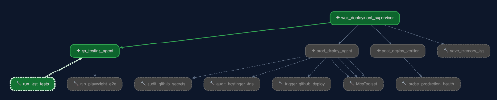

# 🤖 Web Deployment Agents (Google ADK)

An automated multi-agent framework built with **Google ADK (Agent Development Kit)** to run QA testing suites, pre-flight environment audits, production deployments, and post-deployment verification for web applications.

Supports **Google Gemini (Cloud)** as well as **Local Ollama Models** (e.g. `qwen3:8b`, `qwen2.5-coder:14b`) and **MCP (Model Context Protocol)** servers for Supabase, GitHub, and Vercel.

---

## 🏛️ System Architecture & Included Agents



```
                               ┌─────────────────────────────────────────┐
                               │    Web Deployment ADK Supervisor        │
                               │  (Phase 1 -> Phase 2 -> Phase 3 -> AI)  │
                               └────────────────────┬────────────────────┘
                                                    │
         ┌──────────────────────────────────────────┼──────────────────────────────────────────┐
         │                                          │                                          │
         ▼                                          ▼                                          ▼
┌───────────────────────────┐          ┌───────────────────────────┐          ┌───────────────────────────┐
│   1. QA & Testing Suite   │          │  2. Production Deployment │          │ 3. Post-Deploy Verifier   │
│          Agent            │          │      & Audit Agent        │          │          Agent            │
└────────────┬──────────────┘          └────────────┬──────────────┘          └────────────┬──────────────┘
             │                                      │                                      │
  ┌──────────┴──────────┐                ┌──────────┴──────────┐                ┌──────────┴──────────┐
  │ • Jest Unit Tests   │                │ • GitHub Secrets    │                │ • Live Health Probe │
  │ • Playwright E2E    │                │ • DNS Audit         │                │ • Production Smoke  │
  │ • Component Audit   │                │ • Supabase MCP      │                │ • Service Audit     │
  └─────────────────────┘                │ • GitHub MCP        │                └─────────────────────┘
                                         │ • Vercel MCP        │
                                         │ • Trigger GitHub CD │
                                         └─────────────────────┘
```

---

## 📋 Prerequisites & Initial Setup

### 1. Requirements
* **Node.js**: `>= 20.0.0`
* **Python**: `>= 3.11` (for Python ADK CLI & Web UI)
* **GitHub CLI (`gh`)**: Logged in (`gh auth login`)
* **Ollama** *(Optional, for running 100% local models)*: Installed and running (`ollama serve`)

### 2. Environment Configuration
Copy the environment template:

```bash
cp .env.example .env
```

Edit your `.env` file to configure your target application:
```env
# Model Selection: Cloud Gemini or Local Ollama
GEMINI_MODEL=ollama/qwen3:8b

# Target Web Application Location
TARGET_APP_DIR=./

# Target Production Deployment & Health Probes
PROD_APP_URL=https://your-app.com
PROD_DOMAIN=your-app.com

# MCP Server Tokens (Optional - enables Supabase, GitHub, and Vercel MCP Toolsets)
SUPABASE_PROJECT_REF=your_supabase_project_ref
SUPABASE_ACCESS_TOKEN=sbp_xxxxxxxxxxxx
GITHUB_TOKEN=github_pat_xxxxxxxxxxxx
VERCEL_TOKEN=vcp_xxxxxxxxxxxx
```

---

## 🚀 How to Run the Agents

### Option A: Run via Official Google ADK Web UI (`adk web`)

Launches Google ADK's built-in web interface with visual agent graphs and execution traces:

```bash
# Start full Supervisor Web UI (All Agents)
adk web adk_agent
```
Open **`http://localhost:8000`** in your browser.


---

### Option B: Run via Official Google ADK Python CLI (`adk run`)

Interactive terminal agent powered by `google-adk`:

```bash
adk run adk_agent
```

---

### Option C: Run TypeScript Pipeline (`npm run agent:orchestrate`)

Runs Phase 1 (QA) → Phase 2 (Pre-Flight & Deploy) → Phase 3 (Post-Deploy Verify) → AI Synthesis → Appends log to `ADK_MEMORY.md`.

```bash
npm run agent:orchestrate
```

---

## 🔌 Model Context Protocol (MCP) Integration

This repository includes native ADK `McpToolset` integrations for:
* **Supabase MCP** (`@supabase/mcp-server-supabase`): Database queries, schema inspection, and migration audits.
* **GitHub MCP** (`@modelcontextprotocol/server-github`): Repositories, workflows, secrets, issues, and PR management.
* **Vercel MCP** (`@mcp-get/server-vercel`): Deployments, domains, and environment variable audits.

---

## 🧠 Persistent State & Execution Memory

The system maintains execution state (`WebAgentState`) during runs and appends full persistent history to [`ADK_MEMORY.md`](ADK_MEMORY.md).

To inspect execution history:
```bash
cat ADK_MEMORY.md
```
